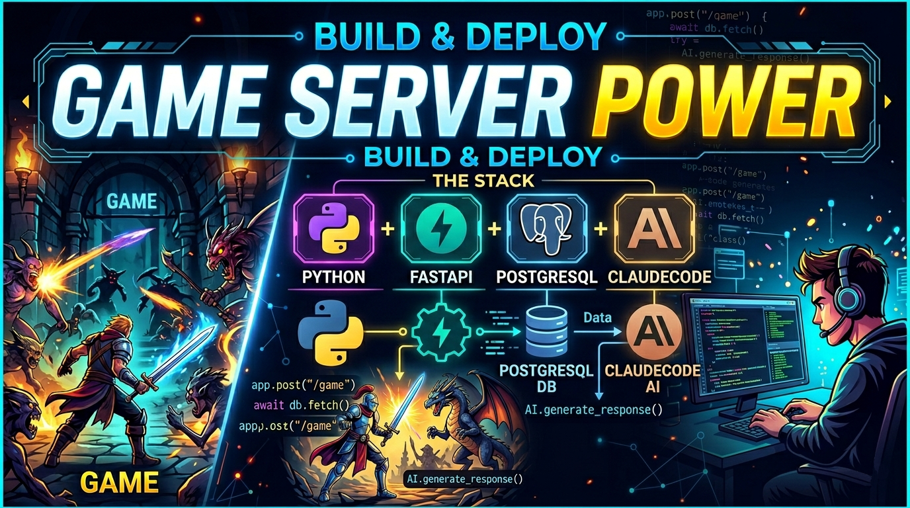
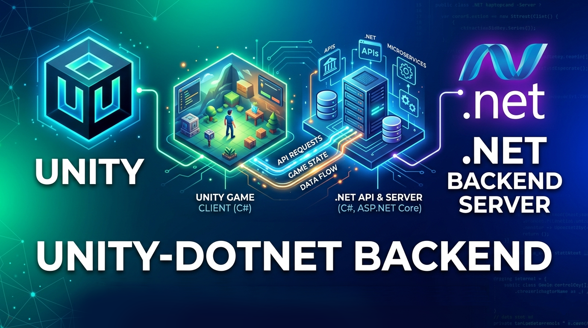
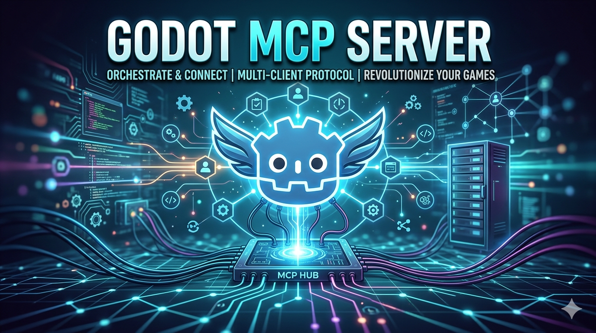

# Berkay Ozercan — Software Engineer · Game Dev · Full-Stack

**Building games, and backends, 3D-2D game arts.**
5+ years across mobile game development, product design, and web development. Currently shipping an indie game in Godot 4 and a full-stack web app with FastAPI + React.

Open to roles in game development, UI/UX design, or web/backend engineering.

---

## Tech Stack

**Game Development**

**Web & Backend**

**Design & Creative**

**Tools & AI**

---

## Featured Projects

| Project | Description | Tech | Link |
|---|---|---|---|
| 🦀 **Regal Rust** | Solo indie 3D physics game — RigidBody3D weapon, destructible environments, force-multiplier upgrade tiers | Godot 4, GDScript, Shaders, MCP | In Development |
| 📊 **Game Dashboard** | Full-stack personal game tracker — REST API backend, React frontend | FastAPI, PostgreSQL, React, Python | In Development |
| 🎭 **Beauty Mask** | Simulation game — mix materials to craft face masks. App Store. | Unity, C# | [App Store](https://apps.apple.com/us/app/beauty-mask/id6447192216) |
| 🔮 **Drop and Merge** | Physics puzzle — ball merge meets balance mechanics. App Store. | Unity, C# | [App Store](https://apps.apple.com/us/app/drop-and-merge/id1668967121) |
| 😈 **Escape from Devil** | Platformer puzzle — solve levels before the devil catches you. | Unity, C# | [itch.io](https://thedebuglounge.itch.io/escape-from-devil) |
| 🀄 **Çanak Okey** | Award-winning multiplayer tile game, millions of players. | Unity, Photoshop | [App Store](https://apps.apple.com/us/app/%C3%A7anak-okey-mynet-oyun/id536523082) |
| 📝 **Word Rush** | Multiplayer word game — race opponents in real time. | Unity, Photoshop | [App Store](https://apps.apple.com/us/app/word-rush-race-with-friends/id1471499627) |

---

## Currently Building

<table>
  <tr>
    <td align="center">
      <a href="https://github.com/BerkayOzercan/regal-rust-backend">
         
        <b>Regal Rust Backend</b>
      </a> 
      FastAPI · PostgreSQL · Python
    </td>
    <td align="center">
      <a href="https://github.com/BerkayOzercan/Unity-RestApi-Example">
         
        <b>Unity REST API Example</b>
      </a> 
      Unity · C# · .NET · REST
    </td>
    <td align="center">
      <a href="https://github.com/BerkayOzercan/godot_mcp_server">
         
        <b>Godot MCP Server</b>
      </a> 
      Godot 4 · GDScript · Python · Claude Code
    </td>
  </tr>
</table>

---

## Open to Work

Looking for roles:
- 🌐 Web / Backend Development (Dotnet, Python, FastAPI)
- 🎮 Game Development (Unity / Godot)
- 🎨 UI/UX Design (mobile & web)

---

## Contact

